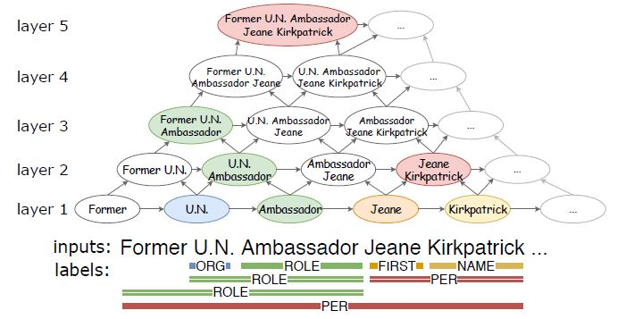
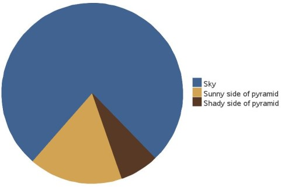

# Pyramid

## Introduction

Pyramid is a novel layered model for Nested Named Entity Recognition (nested NER). This code is based in the paper *Pyramid: A Layered Model for Nested Named Entity Recognition* by Jue Wang et al.



Note that this code is based in my own understanding of the paper. Nevertheless, the authors released the code of the paper at https://github.com/LorrinWWW/Pyramid/.

This repository also contains a step-by-step execution in the notebooks contained in the folder [notebooks](./notebooks).

## Set up

Clone this repository, create default folders and install dependencies:
```sh
git clone https://github.com/DimasDMM/pyramid.git
cd pyramid
mkdir data
mkdir artifacts
pip install -r requirements.txt
```

Download GloVe embeddings:
```sh
cd data
wget http://nlp.stanford.edu/data/glove.6B.zip --no-check-certificate
unzip glove.6B.zip
cd ..
```

It is necessary that you also download the tokenizer and pretrained LM* beforehand:
```sh
python run_download_lm.py --lm_name dmis-lab/biobert-v1.1
```

*Feel free to use any pretrained model from HuggingFace: https://huggingface.co/models

### Dataset

GENIA is the dataset where I have tested this repository. You can download and prepare this dataset with these commands:
```sh
cd data
wget http://www.nactem.ac.uk/GENIA/current/GENIA-corpus/Term/GENIAcorpus3.02.tgz --no-check-certificate
mkdir GENIA
tar -xvf GENIAcorpus3.02.tgz -C GENIA
cd ..
python run_preprocess.py \
    --dataset genia \
    --raw_filepath "./data/GENIA/GENIA_term_3.02/GENIAcorpus3.02.xml" \
    --lm_name dmis-lab/biobert-v1.1 \
    --cased 0
```

If you want to use a different dataset, it must be a JSON file as follows:
```json
{
  "tokens": ["token0", "token1", "token2"],
  "entities": [
    {
      "entity_type": "PER", 
      "span": [0, 1],
    },
    {
      "entity_type": "ORG", 
      "span": [2, 3],
    },
  ]
}
```

## Commands

Fine-tune model:
```sh
python run_training.py \
    --model_ckpt ./artifacts/genia/ \
    --wv_file ./data/glove.6B.200d.txt \
    --use_char_encoder 1 \
    --dataset genia \
    --max_epoches 500 \
    --max_steps 1e9 \
    --total_layers 16 \
    --batch_size 64 \
    --token_emb_dim 200 \
    --char_emb_dim 100 \
    --cased_lm 0 \
    --cased_word 0 \
    --cased_char 0 \
    --hidden_dim 100 \
    --dropout 0.45 \
    --lm_name dmis-lab/biobert-large-cased-v1.1 \
    --lm_emb_dim 1024 \
    --device cuda \
    --continue_training 0 \
    --log_to_file logger_genia.txt
```

Once the model is fine-tunned, run the evaluation script:
```sh
python run_evaluator.py \
    --model_ckpt ./artifacts/genia/ \
    --dataset genia \
    --device cuda
```

### Parameters

The parameters that you can use are the following ones:

- `device`: Device to use: cpu or cuda.
- `model_ckpt`: Path to store the model.
- `wv_file`: (Optional, default=None) Path to file with embeddings of words. If not provided, it won't use the _Word Encoder_ described in the paper.
- `use_char_encoder`: (Optional, default=1) Uses the _Char Encoder_ described in the paper.
- `dataset`: Name of the dataset to use. The dataset files must be located in the folder `./data` with the names `train.<dataset>.json`, `valid.<dataset>.json` and `test.<dataset>.json` for the train, validation and test datasets respectively.
- `max_epoches`: (Optional, default=500) Maximum number of epoches for training.
- `max_steps`: (Optional, default=1e9) Maximum number of steps for training.
- `total_layers`: (Optional, default=16) Number of layers in the pyramid.
- `batch_size`: (Optional, default=64) Batch size for training.
- `token_emb_dim`: (Optional, default=100) Dimension of token embeddings.
- `char_emb_dim`: (Optional, default=100) Dimension of char embeddings.
- `cased_lm`: (Optional, default=1) Use cased _LM Encoder_.
- `cased_word`: (Optional, default=1) Use cased _Word Encoder_.
- `cased_char`: (Optional, default=1) Use cased _Char Encoder_.
- `hidden_dim`: (Optional, default=100) Hidden dimension of LSTM layers in the pyramid. Since the LSTM layers are bidirectional, the actual hidden dimension will be twice the value.
- `dropout`: (Optional, default=0.45) Dropout rate.
- `lm_name`: (Optional, default=dmis-lab/biobert-large-cased-v1.1) Pretrained language model from Hugging Face. The model must be already downloaded in the folder `./artifacts` (use the script `run_download.py` to download and store it).
- `lm_emb_dim`: (Optional, default=1024) Hidden dimension of the language model.
- `continue_training`: (Optional, default=0) In order to avoid overriding a trained model, this flag must be set to `1` if we want to continue training a model from a checkpoint. If the model already exists and the flag is `0`, it will throw an error.
- `log_to_file`: (Optional, default=None) File to store the standard output. 

## Additional comments

This repository includes sbatch files to run the scripts with Slurm. See: https://slurm.schedmd.com/.

---

Have fun! ᕙ (° ~ ° ~)


